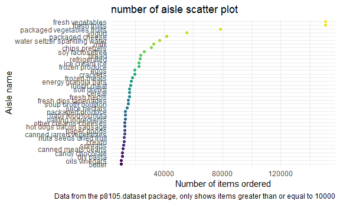
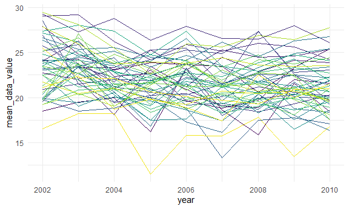
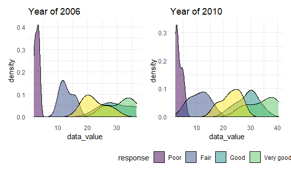

p8105\_hw3\_hx2328
================
Hao Xu
10/20/2021

``` r
library(tidyverse)
```

    ## -- Attaching packages --------------------------------------- tidyverse 1.3.1 --

    ## v ggplot2 3.3.5     v purrr   0.3.4
    ## v tibble  3.1.4     v dplyr   1.0.7
    ## v tidyr   1.1.3     v stringr 1.4.0
    ## v readr   2.0.1     v forcats 0.5.1

    ## -- Conflicts ------------------------------------------ tidyverse_conflicts() --
    ## x dplyr::filter() masks stats::filter()
    ## x dplyr::lag()    masks stats::lag()

``` r
library(patchwork)

knitr::opts_chunk$set(
  fig.width = 6,
  fig.asp = .6,
  out.width = "90%"
)

theme_set(theme_minimal() + theme(legend.position = "bottom"))

options(
  ggplot2.continuous.colour = "viridis",
  ggplot2.continuous.fill = "viridis"
)

scale_colour_discrete = scale_colour_viridis_d
scale_fill_discrete = scale_fill_viridis_d
```

# Problem 1

``` r
library(p8105.datasets)
data("instacart")
```

\`This dataset collects 1384617 observations, each row is a single
product that customer buy using instacart. There are 15 variables. The
key variable includes “add\_to\_cart\_order” representing the order that
customer adds the product to the cart; “reordered” representing if the
customer has ordered it before; “order\_dow” represenging the day of the
week that costomer orders; and “aisle” representing the name of the
aisle.

## How many aisles are there, and which aisles are the most items ordered from?

``` r
aisle_count = 
  instacart %>% 
  group_by(aisle) %>% 
  summarise(n_obs = n())
head(aisle_count)
```

    ## # A tibble: 6 x 2
    ##   aisle                  n_obs
    ##   <chr>                  <int>
    ## 1 air fresheners candles  1067
    ## 2 asian foods             7007
    ## 3 baby accessories         306
    ## 4 baby bath body care      328
    ## 5 baby food formula      13198
    ## 6 bakery desserts         1501

Here, we got the counts of each aisle, there are totally 134 different
kinds of aisles. To get the most popular one, we could do following:

``` r
aisle_count %>% 
  filter(n_obs == max(n_obs))
```

    ## # A tibble: 1 x 2
    ##   aisle             n_obs
    ##   <chr>             <int>
    ## 1 fresh vegetables 150609

Therefore, we got that the most popular one is “fresh vegetables”, and
it has been ordered 150609 times.

## Make a plot that shows the number of items ordered in each aisle, limiting this to aisles with more than 10000 items ordered. Arrange aisles sensibly, and organize your plot so others can read it.

First only get the aisles more than 10000, and arrange them from
according to the number of items:

``` r
aisle_count = 
  aisle_count %>% 
  filter(n_obs >= 10000) %>% 
  mutate(aisle = forcats::fct_reorder(aisle, n_obs))
```

Then get the scatter plot showing the numbers of items ordered in each
aisle:

``` r
aisle_count_plot = 
  aisle_count %>% 
  ggplot(aes(x = n_obs, y = aisle, color = aisle)) +
  geom_point() +
  theme(legend.position = "none") +
  labs(
    title = "number of aisle scatter plot",
    x = "Number of items ordered",
    y = "Aisle name",
    caption = "Data from the p8105.dataset package, only shows items greater than or equal to 10000"
  )
aisle_count_plot
```



## Make a table showing the three most popular items in each of the aisles “baking ingredients”, “dog food care”, and “packaged vegetables fruits”. Include the number of times each item is ordered in your table.

``` r
selected_aisle_table = 
  instacart %>% 
  filter(aisle %in% c("baking ingredients", "dog food care", "packaged vegetables fruits")) %>% 
  group_by(aisle, product_name) %>% 
    summarise(n_obs = n()) %>% 
  mutate(product_ranking = min_rank(desc(n_obs))) %>% 
  filter(product_ranking %in% c(1, 2, 3)) %>% 
  arrange(desc(n_obs)) %>% 
  knitr::kable()
```

    ## `summarise()` has grouped output by 'aisle'. You can override using the `.groups` argument.

``` r
selected_aisle_table
```

| aisle                      | product\_name                                 | n\_obs | product\_ranking |
|:---------------------------|:----------------------------------------------|-------:|-----------------:|
| packaged vegetables fruits | Organic Baby Spinach                          |   9784 |                1 |
| packaged vegetables fruits | Organic Raspberries                           |   5546 |                2 |
| packaged vegetables fruits | Organic Blueberries                           |   4966 |                3 |
| baking ingredients         | Light Brown Sugar                             |    499 |                1 |
| baking ingredients         | Pure Baking Soda                              |    387 |                2 |
| baking ingredients         | Cane Sugar                                    |    336 |                3 |
| dog food care              | Snack Sticks Chicken & Rice Recipe Dog Treats |     30 |                1 |
| dog food care              | Organix Chicken & Brown Rice Recipe           |     28 |                2 |
| dog food care              | Small Dog Biscuits                            |     26 |                3 |

## Make a table showing the mean hour of the day at which Pink Lady Apples and Coffee Ice Cream are ordered on each day of the week; format this table for human readers (i.e. produce a 2 x 7 table).

``` r
mean_hour_table = 
  instacart %>% 
  select(product_name, order_dow, order_hour_of_day) %>% 
  filter(product_name %in% c("Pink Lady Apples", "Coffee Ice Cream")) %>% 
  group_by(product_name, order_dow) %>% 
  summarise(mean_order_hour_of_day = mean(order_hour_of_day)) %>% 
  pivot_wider(names_from = product_name,
              values_from = mean_order_hour_of_day) %>% 
  knitr::kable()
```

    ## `summarise()` has grouped output by 'product_name'. You can override using the `.groups` argument.

``` r
mean_hour_table
```

| order\_dow | Coffee Ice Cream | Pink Lady Apples |
|-----------:|-----------------:|-----------------:|
|          0 |         13.77419 |         13.44118 |
|          1 |         14.31579 |         11.36000 |
|          2 |         15.38095 |         11.70213 |
|          3 |         15.31818 |         14.25000 |
|          4 |         15.21739 |         11.55172 |
|          5 |         12.26316 |         12.78431 |
|          6 |         13.83333 |         11.93750 |

# Problem 2

``` r
data("brfss_smart2010")
```

Firstly clean and tidy the data.

``` r
brfss_smart2010 = 
  brfss_smart2010 %>% 
  janitor::clean_names() %>% 
  filter(topic == "Overall Health",
         response %in% c("Excellent", "Very good", "Good", "Fair", "Poor")) %>% 
  mutate(response = forcats::fct_relevel(response, c("Poor", "Fair", "Good", "Very good", "Excellent"))) %>% 
  rename(state = locationabbr,
         state_location = locationdesc)
```

## In 2002, which states were observed at 7 or more locations? What about in 2010?

For 2002:

``` r
brfss_smart2010 %>% 
  filter(year == 2002) %>% 
  group_by(state, state_location) %>% 
  summarise(n_obs = n()) %>% 
  group_by(state) %>% 
  summarise(num_locations = n()) %>% 
  filter(num_locations >= 7) %>% 
  knitr::kable()
```

    ## `summarise()` has grouped output by 'state'. You can override using the `.groups` argument.

| state | num\_locations |
|:------|---------------:|
| CT    |              7 |
| FL    |              7 |
| MA    |              8 |
| NC    |              7 |
| NJ    |              8 |
| PA    |             10 |

As a result, the states that were observed at 7 or more locations in
2002 are: CT, FL, MA, NC, NJ, PA.

For 2010:

``` r
brfss_smart2010 %>% 
  filter(year == 2010) %>% 
  group_by(state, state_location) %>% 
  summarise(n_obs = n()) %>% 
  group_by(state) %>% 
  summarise(num_locations = n()) %>% 
  filter(num_locations >= 7) %>% 
  knitr::kable()
```

    ## `summarise()` has grouped output by 'state'. You can override using the `.groups` argument.

| state | num\_locations |
|:------|---------------:|
| CA    |             12 |
| CO    |              7 |
| FL    |             41 |
| MA    |              9 |
| MD    |             12 |
| NC    |             12 |
| NE    |             10 |
| NJ    |             19 |
| NY    |              9 |
| OH    |              8 |
| PA    |              7 |
| SC    |              7 |
| TX    |             16 |
| WA    |             10 |

As a result, the states that were observed at 7 or more locations in
2010 are: CA, CO, FL, MA, MD, NC, NE, NJ, NY, OH, PA, SC, TX, WA.

## Construct a dataset that is limited to Excellent responses, and contains, year, state, and a variable that averages the data\_value across locations within a state. Make a “spaghetti” plot of this average value over time within a state (that is, make a plot showing a line for each state across years – the geom\_line geometry and group aesthetic will help).

Firstly construct the dataset

``` r
brfss_excellent = brfss_smart2010 %>% 
  filter(response == "Excellent") %>% 
  group_by(state, year) %>% 
  summarise(mean_data_value = mean(data_value, na.rm = TRUE))
```

    ## `summarise()` has grouped output by 'state'. You can override using the `.groups` argument.

Then create the plot.

``` r
#this is for displaying the plot, so omit the legend for states.
brfss_excellent %>% 
  ggplot(aes(x = year, y = mean_data_value, color = state)) + 
  geom_line(aes(group = state)) + 
  theme(legend.position = "none")
```



``` r
#This is for saving the plot, so the legend is included.
brfss_excellent_plot = brfss_excellent %>% 
  ggplot(aes(x = year, y = mean_data_value, color = state)) + 
  geom_line(aes(group = state))
```

## Make a two-panel plot showing, for the years 2006, and 2010, distribution of data\_value for responses (“Poor” to “Excellent”) among locations in NY State.

Firstly, clean the data and select only the useful variables. Also clean
the variable of state\_location to make the names neat.

``` r
two_panel_2006 = brfss_smart2010 %>% 
  filter(year == 2006,
         state == "NY") %>% 
  separate(state_location, into = c("state", "location"), sep = 5) %>% 
  select(year, location, data_value, response)

two_panel_2010 = brfss_smart2010 %>% 
  filter(year == 2010,
         state == "NY") %>% 
  separate(state_location, into = c("state", "location"), sep = 5) %>% 
  select(year, location, data_value, response)
```

Next, create the plot of distribution:

``` r
two_panel_plot_2006 = two_panel_2006 %>% 
  ggplot(aes(x = data_value, fill = response)) + 
  geom_density(alpha = .5) + 
  labs(title = "Year of 2006") + 
  theme(legend.position = "none")

two_panel_plot_2010 = two_panel_2010 %>% 
  ggplot(aes(x = data_value, fill = response)) + 
  geom_density(alpha = .5) + 
  labs(title = "Year of 2010")
  
two_panel_plot = two_panel_plot_2006 + two_panel_plot_2010
two_panel_plot
```



# Problem 3

## Load, tidy, and otherwise wrangle the data. Your final dataset should include all originally observed variables and values; have useful variable names; include a weekday vs weekend variable; and encode data with reasonable variable classes. Describe the resulting dataset (e.g. what variables exist, how many observations, etc).

``` r
accel = read_csv("./problem3/accel_data.csv")
```

    ## Rows: 35 Columns: 1443

    ## -- Column specification --------------------------------------------------------
    ## Delimiter: ","
    ## chr    (1): day
    ## dbl (1442): week, day_id, activity.1, activity.2, activity.3, activity.4, ac...

    ## 
    ## i Use `spec()` to retrieve the full column specification for this data.
    ## i Specify the column types or set `show_col_types = FALSE` to quiet this message.

``` r
accel = accel %>% 
  janitor::clean_names() %>% 
  mutate(day_type = recode(day, 
                           "Monday" = "weekday",
                           "Tuesday" = "weekday",
                           "Wednesday" = "weekday",
                           "Thursday" = "weekday",
                           "Friday" = "weekday",
                           "Saturday" = "weekend",
                           "Sunday" = "weekend"),
         day = forcats::fct_relevel(day, c("Monday", "Tuesday", "Wednesday",
                                           "Thursday", "Friday", "Saturday",
                                           "Sunday")),
         day_num = as.numeric(day)) %>% 
  arrange(week, day_num) %>% 
  relocate(week, day, day_type, day_num, day_id)
```

The modified data has totally 35 observations of 1445 variables. The
“week” indicates the number of weeks; the “day” represents the day of
each week; the “day\_type” represents whether the day is weekday or
weekend; the “day\_id” represents different number of days; and the
activity\_\* are the activity counts for each minute of a 24-hour day
starting at midnight, and there are 1440 of them since there are 1440
minutes each day.

## Traditional analyses of accelerometer data focus on the total activity over the day. Using your tidied dataset, aggregate accross minutes to create a total activity variable for each day, and create a table showing these totals. Are any trends apparent?
